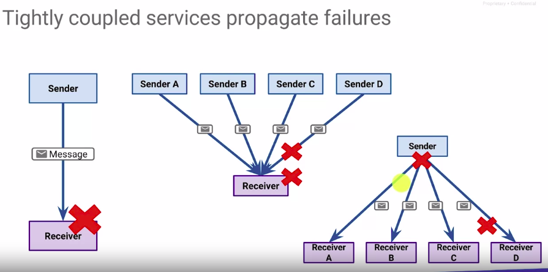
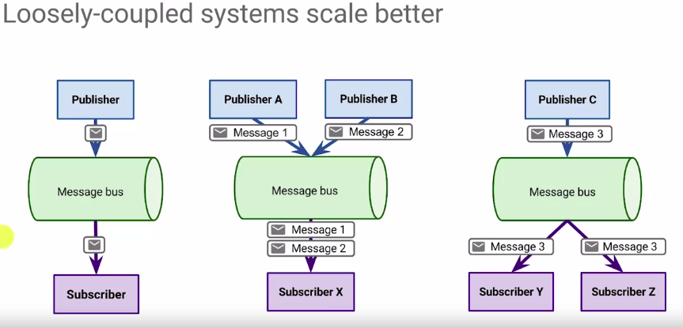
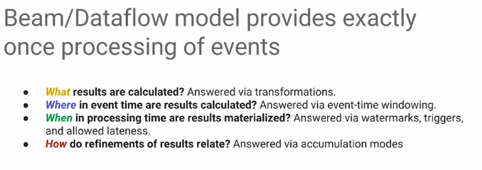
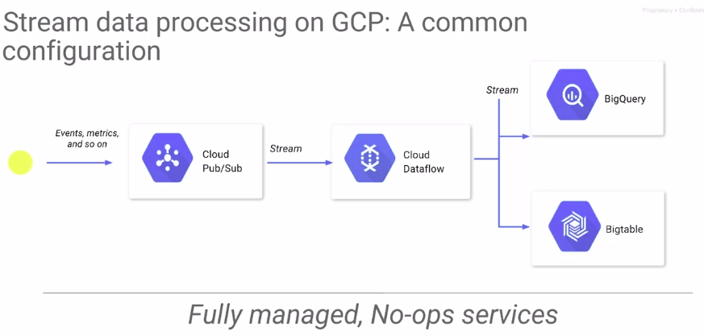

# Module 1: Architecture of Streaming Analytcs Pipelines

## Challenge #1: Variable volumes require ability of ingest to scale and be fault-tolerant

* Message Bus

## Challenge #2 : Latency is to be expected

* Cloud Dataflow

## Challenge #3 : Need instant insights

### Diferença entre BigQuery e Bigtable

* a latência no __BigQuery__ está na ordem de __segundos__. BigQuery é SQL
* a latência no __Bigtable__ está na ordem de __milissegundos__, Bigtable é NoSQL.

## Module 1 Quiz

### Dataflow offers the following that makes it easy to create resilient streaming pipelines when working with unbounded data:

* __Ability to flexibly reason about time__
* __Controls to ensure correctness__
* Global message bus to buffer messages
* SQL support to query in-process results

### Match the GCP product with its role when designing streaming systems

Product	Role
__ 1. Pub/Sub	B. Global message queue
__ 2. Dataflow	A. Controls to handle late-arriving and out-of-order data
__ 3. BigQuery	D. Query data as it arrives from streaming pipelines
__ 4. Bigtable	C. Latency in the order of milliseconds when querying against overwhelming volume