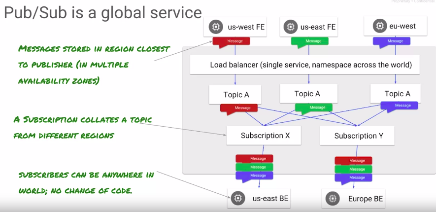

# Module 2: Ingesting Variable Volumes



## Lab 1 : Publish streaming data into Pub/Sub

```sh
cp -r /training/training-data-analyst/ .
```

### Task 2: Create Pub/Sub topic and subscription

```sh
gcloud pubsub topics create sandiego
gcloud pubsub topics publish sandiego --message "hello"
gcloud pubsub subscriptions create --topic sandiego mySub1
gcloud pubsub subscriptions pull --auto-ack mySub1

gcloud pubsub topics publish sandiego --message "hello again"
gcloud pubsub subscriptions pull --auto-ack mySub1

gcloud pubsub subscriptions delete mySub1
```

### Task 3: Simulate traffic sensor data into Pub/Sub

```sh
cd ~/training-data-analyst/courses/streaming/publish
cat send_sensor_data.py
```

```python
#!/usr/bin/env python

# Copyright 2018 Google Inc.
#
# Licensed under the Apache License, Version 2.0 (the "License");
# you may not use this file except in compliance with the License.
# You may obtain a copy of the License at
#
#     http://www.apache.org/licenses/LICENSE-2.0
#
# Unless required by applicable law or agreed to in writing, software
# distributed under the License is distributed on an "AS IS" BASIS,
# WITHOUT WARRANTIES OR CONDITIONS OF ANY KIND, either express or implied.
# See the License for the specific language governing permissions and
# limitations under the License.

import time
import gzip
import logging
import argparse
import datetime
from google.cloud import pubsub

TIME_FORMAT = '%Y-%m-%d %H:%M:%S'
TOPIC = 'sandiego'
INPUT = 'sensor_obs2008.csv.gz'

def publish(publisher, topic, events):
   numobs = len(events)
   if numobs > 0:
       logging.info('Publishing {0} events from {1}'.format(numobs, get_timestamp(events[0])))
       for event_data in events:
         publisher.publish(topic,event_data)

def get_timestamp(line):
   ## convert from bytes to str
   line = line.decode('utf-8')

   # look at first field of row
   timestamp = line.split(',')[0]
   return datetime.datetime.strptime(timestamp, TIME_FORMAT)

def simulate(topic, ifp, firstObsTime, programStart, speedFactor):
   # sleep computation
   def compute_sleep_secs(obs_time):
        time_elapsed = (datetime.datetime.utcnow() - programStart).seconds
        sim_time_elapsed = (obs_time - firstObsTime).seconds / speedFactor
        to_sleep_secs = sim_time_elapsed - time_elapsed
        return to_sleep_secs

   topublish = list() 

   for line in ifp:
       event_data = line   # entire line of input CSV is the message
       obs_time = get_timestamp(line) # from first column

       # how much time should we sleep?
       if compute_sleep_secs(obs_time) > 1:
          # notify the accumulated topublish
          publish(publisher, topic, topublish) # notify accumulated messages
          topublish = list() # empty out list

          # recompute sleep, since notification takes a while
          to_sleep_secs = compute_sleep_secs(obs_time)
          if to_sleep_secs > 0:
             logging.info('Sleeping {} seconds'.format(to_sleep_secs))
             time.sleep(to_sleep_secs)
       topublish.append(event_data)

   # left-over records; notify again
   publish(publisher, topic, topublish)

def peek_timestamp(ifp):
   # peek ahead to next line, get timestamp and go back
   pos = ifp.tell()
   line = ifp.readline()
   ifp.seek(pos)
   return get_timestamp(line)


if __name__ == '__main__':
   parser = argparse.ArgumentParser(description='Send sensor data to Cloud Pub/Sub in small groups, simulating real-time behavior')
   parser.add_argument('--speedFactor', help='Example: 60 implies 1 hour of data sent to Cloud Pub/Sub in 1 minute', required=True, type=float)
   parser.add_argument('--project', help='Example: --project $DEVSHELL_PROJECT_ID', required=True)
   args = parser.parse_args()

   # create Pub/Sub notification topic
   logging.basicConfig(format='%(levelname)s: %(message)s', level=logging.INFO)
   publisher = pubsub.PublisherClient()
   event_type = publisher.topic_path(args.project,TOPIC)
   try:
      publisher.get_topic(event_type)
      logging.info('Reusing pub/sub topic {}'.format(TOPIC))
   except:
      publisher.create_topic(event_type)
      logging.info('Creating pub/sub topic {}'.format(TOPIC))

   # notify about each line in the input file
   programStartTime = datetime.datetime.utcnow() 
   with gzip.open(INPUT, 'rb') as ifp:
      header = ifp.readline()  # skip header
      firstObsTime = peek_timestamp(ifp)
      logging.info('Sending sensor data from {}'.format(firstObsTime))
      simulate(event_type, ifp, firstObsTime, programStartTime, args.speedFactor)
```

```sh
cat download_data.sh
gsutil cp gs://cloud-training-demos/sandiego/sensor_obs2008.csv.gz .
```

```sh
./download_data.sh
sudo apt-get install -y python-pip
sudo pip install -U google-cloud-pubsub

./send_sensor_data.py --speedFactor=60 --project $DEVSHELL_PROJECT_ID
```

```sh
cd ~/training-data-analyst/courses/streaming/publish

gcloud pubsub subscriptions create --topic sandiego mySub2
gcloud pubsub subscriptions pull --auto-ack mySub2

gcloud pubsub subscriptions delete mySub2
```

```sh
```

```sh
```

```sh
```